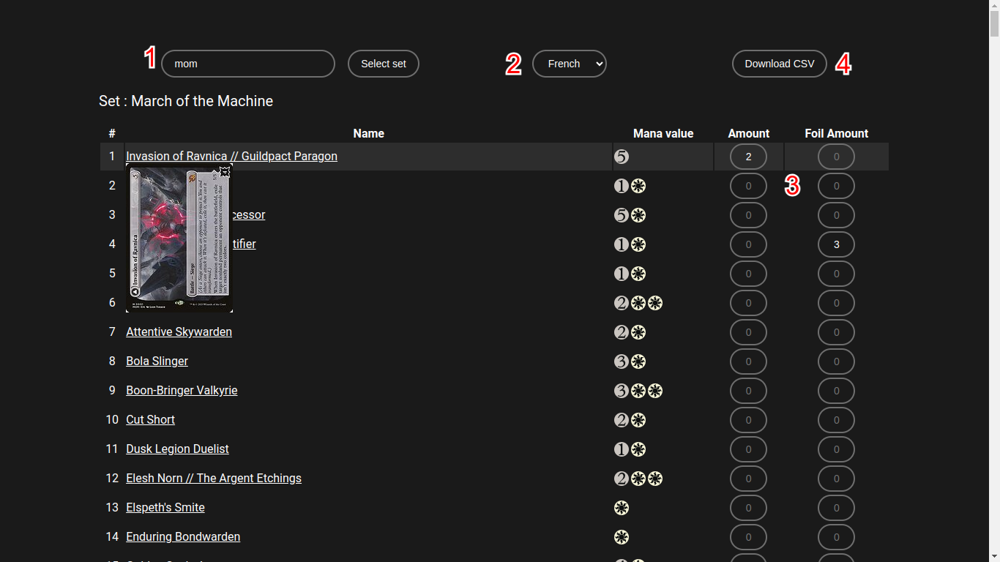
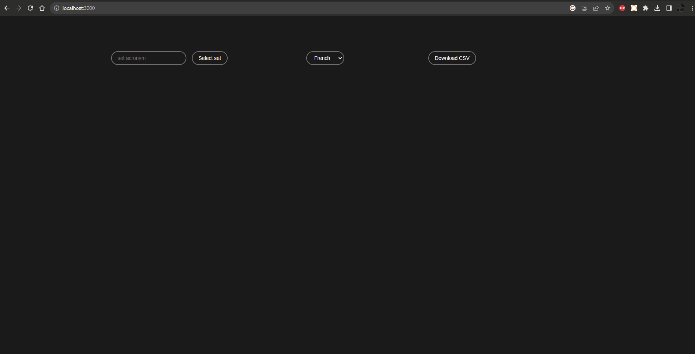

# BIMF - BulkImporter for MoxField

> October 2023

> [Github repository](https://github.com/Vredeza/bimf)

## About this project

In October 2023, I began using [Moxfield](https://moxfield.com), a website to track and manage my collection of
[Magic: The Gathering](https://en.wikipedia.org/wiki/Magic:_The_Gathering) cards. Doing so, I quickly realized
that it was missing an important feature : being able to register a lot of cards at the same time. I had to scroll through
a list of cards from a single set a few dozen of times each time I bought cards.

I then decided to start making an app to quicken this flow : BIMF (BulkImporter for MoxField). It works
as follows : you enter the set from which you want to register cards (usually after buying a bunch at once);
BIMF will then show you the list of cards from this set. Afterward, you can enter the amount of card you possess.
The app will generate a .csv file that can be sent to Moxfield, and all the cards will be added your collection.

BIMF uses a public API ([Scryfall](https://scryfall.com)) to access existing cards and list them. You can
find more information about the project on its [GitHub repository](https://github.com/Vredeza/bimf) and even use the app
[here](https://vredeza.github.io/bimf).

## What I learned from it

For this project, I decided to learn the React framework. I used it with external APIs. I also learnt to host React projects on GitHub using `react-gh-pages`.

## Screenshots

