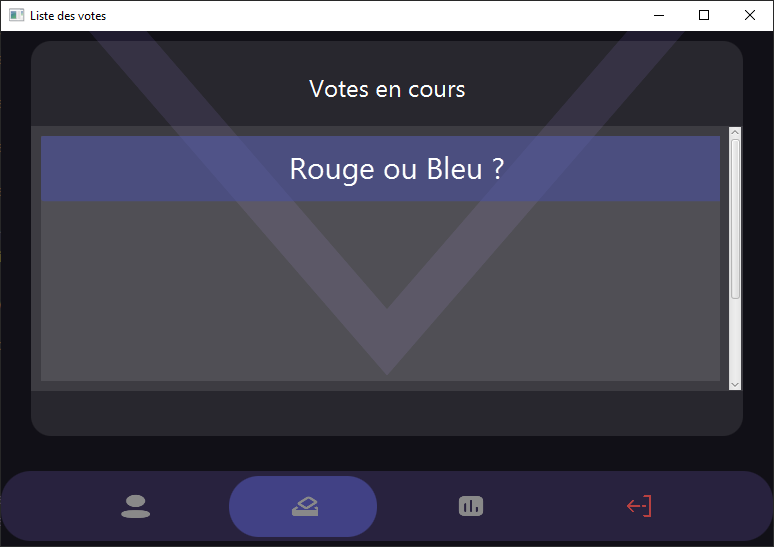

# E-Voting System

> October 2022 - April 2023 (second year of BUT)

> [GitHub repository](https://github.com/Vredeza/sae-3.01-vote)

## About this project

As part of the 2nd-year project of BUT, I was grouped with 3 classmates to develop a secured e-voting application. The objective was to provide a service for participating in referendums. This service was composed of 3 applications : a client, a server, and an entity responsible for storing the encrypted vote results before the count - the scrutineer.

Ballots (represented by *0* or *1*) are encrypted before being sent to the server to ensure that it remains unaware of their content. At the end of the designated voting period, the server sends the encrypted ballots.

## ElGamal encryption

The project's goal was to implement the ElGamal cryptosystem.

With this implementation, we achieved the following properties:

- **Homomorphism through addition** : It allows performing an operation on two encrypted messages to add them together without needing to decrypt them.
- **Non-determinism** : Two encryptions of the same message will not be equal. Therefore, comparing the ciphertexts does not reveal the proportion of votes.
- **Asymmetry** : Clients can encrypt, but only the server can decrypt using a pair of public/private keys.

## Project managment

This project provided an opportunity to implement the agile project management methods learned concurrently. We established a flexible framework that promoted collaboration and adaptability to changes.

We used Trello, a project management tool facilitating the representation of the backlog, tasks, and schedules.

## Skills put to use

- Java
- Docker
- Project Management

## Screenshots

