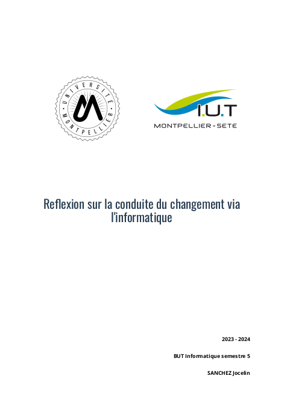

# IUTEX

> September 2023

> [GitHub repository](https://github.com/Vredeza/IUTexTemplate)

## About this project

While taking notes in [MarkDown](https://en.wikipedia.org/wiki/Markdown), I realized it would be practical to have
a way to convert it in ready-to-send PDFs. I then started making it by learning [LaTeX](https://en.wikipedia.org/wiki/LaTeX), 
an app software used to generate PDFs.

## How it works

The template takes a Markdown file with a little metadata (title, author, school year) inside. And generates
the document, with a title page (including logos from my school), headers and footers.

## Screenshots

