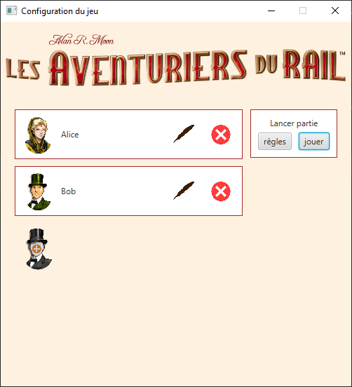
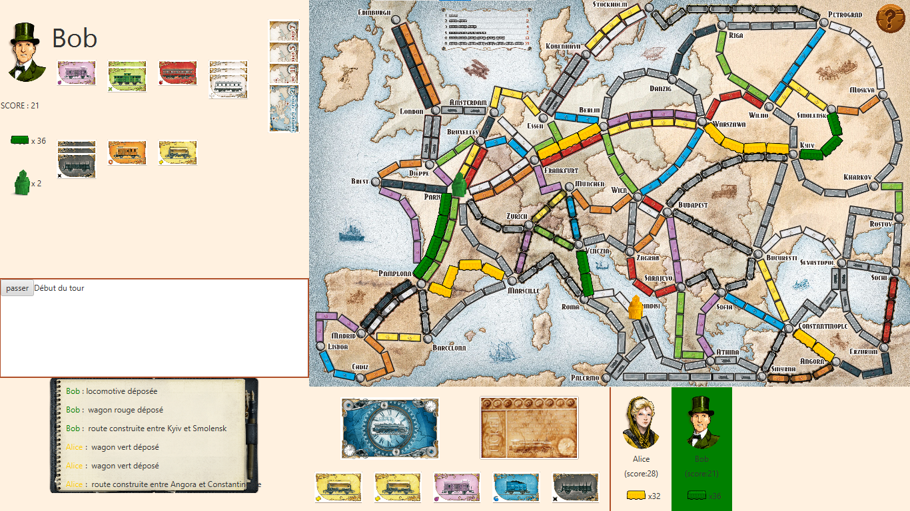

# Ticket to ride : Europe

> January 2022 - June 2021 (first year of BUT)

## About this project

During the first year of BUT, I was tasked to make a digital version of the tabletop game [Ticket to Ride](https://en.wikipedia.org/wiki/Ticket_to_Ride_(board_game)). This school work was done in pairs.

> Players collect and play train car cards to claim train routes across the map. Points are earned based on the length of the claimed routes, whoever completes the longest continuous railway, and whether the player can connect distant cities which are determined by drawing ticket cards. - [Wikipedia](https://en.wikipedia.org/wiki/Ticket_to_Ride_(board_game))

Its main point was to assess students' algorythmical knowledge by implementing basic features. These feature include : 

- game loop : player turns
- drawing cards
- checking if player can take a road / train station
- letting a player chose which cards to pay with
- game end when a certain score is acheived

In a seconde part, the project was more about UI/UX design with a short course.

## Skills put to use

- Java
- JavaFX
- A bit of math

## Screenshots

