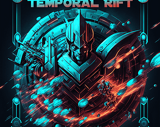
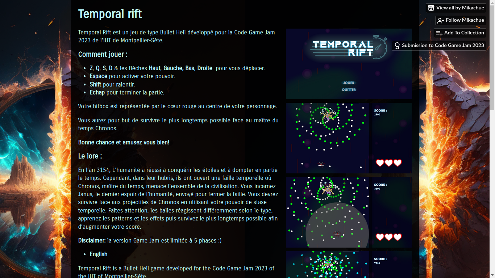

# Temporal Rift

> January 2023

> [itch.io page](https://mikachue.itch.io/temporal-rift)

## About this project

From 23 to 25 January 2023, I participated in the [7th edition of the Code Game Jam](https://codegamejam.extragames.fr/editions-precedentes/edition-7-soon/). 
It is a video game creation event, by team, on a given theme. This year, the theme was "masters of time".

I teamed up with 5 classmates to design this game during this 30 hours adventure. 
We chose to make a bullet-dodging game with an ability to stop time. 
You can find and play the game on [Mikachue's itch.io page](https://mikachue.itch.io/temporal-rift). 
My work on this was mostly about drawing, game design, with a bit of coding. 
Overall, our game was quite well received, as it received the second prize out of 36 teams.

## What I learned from it

This project was mostly about time and skill management. 
We needed to be quick and assign the tasks to make the best use out of each member. 
I mainly learned about game design, including what to do to give the player the best experience possible, without frustrating them nor making the game too easy. 
I also re-discovered Unity and editing software, to make the games assets and mechanics.

## Skills put to use 

- Unity
- C#
- Game design

## Screenshots

